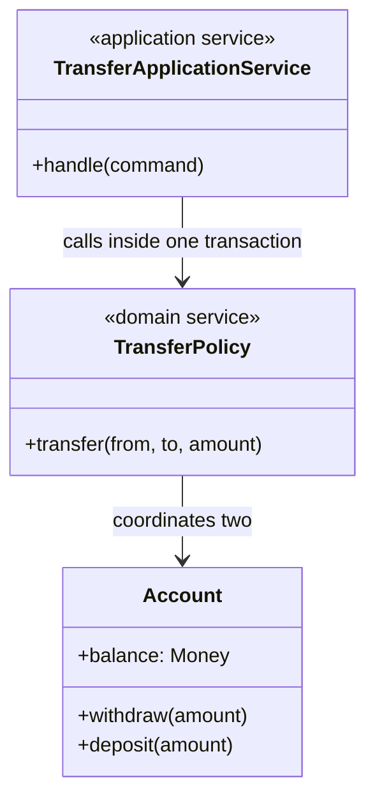

# Domain Service

A domain service is a stateless operation, named in the language of the business, for a rule that involves several objects and belongs to none of them, so that the rule lives in the domain layer instead of leaking into a controller or an entity that does not own it.

## What it is
<!--meta block=description-->

Some business rules do not belong to one object: moving money touches two accounts, and pricing an order needs the customer, the catalogue and the promotions. Forced into one entity, the rule makes that entity know about the others. A domain service is a stateless object named for the activity, such as a funds transfer, that holds the rule and takes the entities as arguments. It keeps the model rich where the logic really lives.

## Explained
<!--meta block=explain-->

A domain service holds a business rule that spans several objects and belongs to none of them, as a stateless object named for the activity, such as a funds transfer. It takes the [entities](./entity.md) as arguments, lets each guard its own state, and coordinates the rule between them. Without it the rule tends to land on an arbitrary owner, or get copied into each controller, where the copies can drift. Choose it over an entity method when the rule has no natural owner. Choose it over an [application service](../enterprise/service-layer.md) when another entry point must reuse the rule: an application service orchestrates use cases and carries no rule.

- **Anemic drift.** Move a rule into a service only after asking whether an entity owns it, or your entities shrink to data bags.
- **Dumping ground.** A service named Manager grows without limit; name each one for one domain verb and keep it small.
- **No memory.** It keeps no state between calls, so an operation that needs history belongs on an entity or aggregate.

**Example.** A bank transfers 5,000 cents between two accounts. Put the rule on Account and it must know every other account and the daily-limit policy; copy it into the web controller and the batch importer, and the importer skips the same-account check. A FundsTransfer service takes both accounts, rejects a transfer to the same id, and calls withdraw then deposit; each Account still refuses to overdraw. Both entry points call it, so the check exists once. The application service's transaction makes withdraw and deposit succeed or fail together. A unit test needs two Account objects and no database. The cost is one more class to find, so name it for the business verb.

## How it works
<!--meta block=structure-->

The service is a verb with a noun's name. It receives domain objects, asks them to do the parts that are theirs, and coordinates the rule that spans them. It holds no state of its own between calls, and its interface speaks only domain terms. Evans gives three tests: the operation is a domain concept, it involves several domain objects, and it is stateless.



The caller above it is an application service (see [Service Layer](../enterprise/service-layer.md)): it opens the transaction and loads the accounts, then calls the domain service to apply the rule. The domain service never loads, saves or sends anything, so you can test it with plain objects.

## Variations
<!--meta block=variations-->

- **Pure calculation service** — Takes values in and returns a value, with no object mutated, for example a tax or shipping-cost calculation over an order and a rate table. It is the easiest kind to test.
- **Coordinating service** — Changes several [aggregates](./aggregate.md) in step, such as a transfer between two accounts. Keep the changes inside one transaction only when the aggregates sit in one consistency boundary; otherwise raise events. The sketch assumes both accounts sit in one boundary. Across boundaries, the service changes one aggregate and records a domain event; a handler changes the other, so the two are eventually consistent.
- **Policy service behind an interface** — The domain declares the interface, such as an `ExchangeRates` lookup, and infrastructure implements it; the application service passes the implementation into the service's constructor. The rule stays in the domain while the data comes from outside. A call to it can fail or lag, so pass the value in as an argument when you can.
- **Application service (not the same thing)** — A thin use-case coordinator that owns transactions and security, with no business rule inside. Mixing the two is the usual way a domain service goes wrong.

## Trade-offs
<!--meta block=tradeoffs-->

### Pros
<!--meta polarity=pro-->

- **Gives a cross-object rule one named home** in the ubiquitous language, instead of two copies in two controllers.
- **Keeps entities and value objects focused** on their own state and invariants.
- **Tests with plain objects.** It is stateless and free of I/O, so a pure or coordinating service needs no database or framework; a policy service needs a stub of its interface.
- **Keeps the rule in the domain layer,** not in the web or persistence code that calls it.

### Cons
<!--meta polarity=con-->

- **Invites an [anemic domain model](../../hazards/anemic-domain-model.md).** If every rule moves into services, entities shrink to data bags; ask first whether an entity owns the rule.
- **Becomes a dumping ground.** An `OrderManager` that keeps adding unrelated methods is a procedural script inside a service class.
- **Blurs with application services.** A rule hidden in a use-case coordinator cannot be reused by another entry point.
- **Statelessness limits it.** An operation that needs memory between calls belongs in an entity or an aggregate.

## When to use it
<!--meta block=usage-->

### Reach for it when
<!--meta polarity=when-->

- **A business rule spans several entities or aggregates** and no one of them is the natural owner.
- **The operation is a verb of the domain,** something a domain expert would name, such as "transfer" or "allocate stock".
- **You want to put a rule behind an interface** the domain defines and infrastructure fills in.

### Avoid when
<!--meta polarity=avoid-->

- **One entity or value object can own the rule.** Put it there, where the data lives.
- **The step is orchestration only,** such as load, call, save, publish. That belongs to an application service.
- **The operation is technical,** such as sending email or writing a file. That is an infrastructure service.

## Code sketch
<!--meta block=sketch-->

```typescript summary="TypeScript — a transfer rule that spans two accounts, kept stateless and free of I/O"
class Account {
  constructor(readonly id: string, private balanceCents: number) {}
  get balance() { return this.balanceCents; }
  withdraw(cents: number) {
    if (cents <= 0) throw new Error("amount must be positive");
    if (cents > this.balanceCents) throw new InsufficientFunds(this.id);
    this.balanceCents -= cents;
  }
  deposit(cents: number) {
    if (cents <= 0) throw new Error("amount must be positive");
    this.balanceCents += cents;
  }
}

// The domain service: one rule, two accounts, no state, no database.
class FundsTransfer {
  execute(from: Account, to: Account, cents: number) {
    if (from.id === to.id) throw new Error("same account");
    from.withdraw(cents);   // each account guards its own invariant
    to.deposit(cents);
  }
}

// The application service owns the transaction and the loading.
async function handleTransfer(cmd: TransferCommand, repo: AccountRepository) {
  // If deposit throws, the transaction discards both loaded accounts.
  await repo.inTransaction(async () => {
    const [from, to] = await repo.getMany([cmd.from, cmd.to]);
    new FundsTransfer().execute(from, to, cmd.cents);
    await repo.saveAll([from, to]);
  });
}
```

## Where it shows up
<!--meta block=fluency-->

<!-- fluency:start -->

<!-- GENERATED by gen-tours from docs/data/learning-paths.json. Do not edit this block. -->

- [Service Boundaries](../../themes/service-boundaries.md) — Put a rule that spans several aggregates in a stateless domain service. {#fluency-service-boundaries}

<!-- fluency:end -->

## How it relates
<!--meta block=relationships-->

<!-- relationships:start -->

<!-- GENERATED by gen-relations from docs/data/relations.json. Do not edit this block. -->

**Combines with**

- [Aggregate](./aggregate.md) — A domain service coordinates a rule across several aggregates
- [Entity](./entity.md) — It takes entities as arguments and lets each guard its own state
- [Service Layer](../enterprise/service-layer.md) — An application service orchestrates the use case and calls this for the rule.

**Exposed to**

- [Anemic Domain Model](../../hazards/anemic-domain-model.md) — Moving every rule into services leaves entities as data bags

<!-- relationships:end -->
